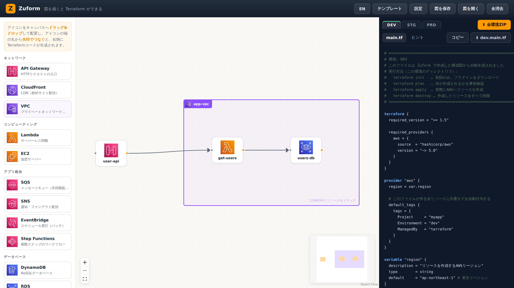

# Zuform

[](https://github.com/tsekino62/zuform/actions/workflows/ci.yml)

[日本語](README.md)

About the name: *zu* (図, "diagram") × *form* — a tool that turns a diagram into Terraform.

Zuform is a beginner-friendly web tool: **drag and drop AWS resources like you would in draw.io**, connect the icons with arrows, and it **generates Terraform for three environments (DEV / STG / PRD)**.



**Live demo: <https://tsekino62.github.io/zuform/>** (nothing to install — try it in the browser)

> Note: comments inside the generated Terraform, the hint messages, and the messages produced when an architecture file fails to parse are still in Japanese. Translating the generated output is tracked separately.

## What it does

- Drag and drop **API Gateway / CloudFront / Lambda / EC2 / SQS / SNS / EventBridge / Step Functions / DynamoDB / RDS / S3 / VPC** from the palette
- **Connect resources with arrows** by dragging from the dot on an icon's right edge to the dot on another icon's left edge
- Place resources inside a **VPC frame** (a resizable group)
- **Generate Terraform in real time** based on what each connection means:
  - API Gateway → Lambda: HTTP API, integration, route, and invoke permission
  - Lambda → RDS: VPC config, security groups, and environment variables
  - Lambda → DynamoDB / S3 / SQS / SNS: **least-privilege IAM policies** and environment variables
  - SQS → Lambda: event source mapping + DLQ (dead-letter queue)
  - EventBridge → Lambda / Step Functions: scheduled batches (cron / rate)
  - Step Functions → Lambda: a workflow definition that runs in the order you connected them
  - CloudFront → S3: static site delivery from a private bucket via OAC
- **Template gallery**: start from one of seven common architectures, filtered by use case (API development / batch / static sites / file storage / web servers)
- **Naming rules**: configure a pattern such as `{project}-{env}-{name}`, applied to every physical resource name and to the common tags (Project / Environment / ManagedBy)
- **Three environments (DEV / STG / PRD)**:
  - Choose per node which environments it is created in (for example, WAF in PRD only, scratch resources in DEV only)
  - Environment profiles: DEV stays small and cheap (`db.t3.micro`, no deletion protection), PRD is hardened (multi-AZ, deletion protection, 7-day backups)
  - Download everything as a ZIP laid out as `environments/{dev,stg,prd}/main.tf` (one tfstate per environment)
- Save and open diagrams as an **architecture file (`*.awsarch.yaml`)**, with autosave to the browser
- **Japanese / English UI**, switched instantly from the header button (your choice is remembered in the browser)

Icons come from the [AWS Architecture Icons](https://aws.amazon.com/architecture/icons/) set ([NOTICE](web/src/assets/aws-icons/NOTICE.md)).

## Getting started

You need [Deno](https://deno.com/) 2.x. (There is no npm / package.json: dependencies live in `deno.json`, and Deno generates `node_modules/` for you.)

```bash
deno task dev
```

Then open http://localhost:5173 in your browser.

| Command | What it does |
|---------|--------------|
| `deno task dev` | Start the dev server |
| `deno task build` | Production build (`web/dist/`) |
| `deno task test` | Run the generator tests (snapshots included) |
| `deno task test:update` | Update the snapshots |
| `deno task check` | Type check |

## Using the generated code

1. Click "⬇ All environments (ZIP)" in the right-hand panel and unpack the archive
2. Change into an environment directory and run:

```bash
cd environments/dev
terraform init
terraform plan
terraform apply
```

- For architectures that include Lambda, place the deployment package (zip) at `build/<function-name>.zip` (the generated code has comments explaining the steps)
- **About IAM**: Terraform only creates what you declare. Zuform derives the Lambda execution role and a least-privilege policy per connection from your arrows, but the user or CI identity running `terraform apply` still needs IAM permissions of its own (`iam:CreateRole` and friends)

### Editing the generated code by hand

There are three ways to do it, and none of them are lost when the diagram is regenerated:

1. **The node's "Extra HCL" field** (recommended): select a node and write attributes into the inspector's "Extra HCL" box; they are inserted at the end of that resource block (for example `memory_size = 512`). The value is stored in the architecture file as `extra_hcl`
2. **Append to `custom.tf`**: add new resources to the `custom.tf` bundled in the ZIP (Terraform merges every `.tf` file in a directory)
3. **Override**: to change only an attribute of a generated resource, create `main_override.tf` and write just the attributes you want to change in a resource block of the same name ([override files](https://developer.hashicorp.com/terraform/language/files/override))

## The architecture file (`*.awsarch.yaml`)

**"Save diagram" in the header writes YAML (`diagram.awsarch.yaml`).**
It is a declarative format you can read and hand-edit, which also makes it easy to review in a Git diff.

"Open diagram" accepts **both `*.awsarch.yaml` (YAML) and the legacy `*.awsdiagram.json`**
(detected from the extension). Legacy JSON is still readable, but saving always produces YAML.

```yaml
version: 1
project: myapp          # the {project} token of the naming rule
naming:
  pattern: "{project}-{env}-{name}"
  commonTags: true      # add the Project / Environment / ManagedBy tags

resources:              # key = resource name (used as the diagram label and the Terraform name)
  my-vpc:
    type: vpc
  user-api:
    type: apigateway
  get-users:
    type: lambda
    in: my-vpc          # place it inside a VPC frame (only type: vpc can be used with `in`)
    envs: [dev, stg]    # limit which environments create it (all three by default)
    extra_hcl: |        # inserted verbatim at the end of the generated resource block
      memory_size = 512
  users-db:
    type: rds
    in: my-vpc

connections:            # "caller -> callee"
  - user-api -> get-users
  - get-users -> users-db

layout:                 # coordinates (optional); vpc takes [x, y, width, height], everything else [x, y]
  my-vpc: [360, 80, 560, 340]
  user-api: [80, 210]
```

| Key | Description |
|-----|-------------|
| `version` | Version of the file format (currently `1`) |
| `project` / `naming` | Naming rules; mirrors the settings modal |
| `resources.<name>.type` | `apigateway` / `lambda` / `ec2` / `rds` / `dynamodb` / `s3` / `sqs` / `sns` / `eventbridge` / `stepfunctions` / `cloudfront` / `vpc` |
| `resources.<name>.in` | Name of the parent VPC resource |
| `resources.<name>.envs` | Environments that create this resource (`dev` / `stg` / `prd`) |
| `resources.<name>.extra_hcl` | Extra HCL injected into the generated code (same as the inspector's "Extra HCL") |
| `connections` | Array of `"from -> to"` strings |
| `layout` | Coordinates. **Omit it and the diagram is laid out automatically** (left to right) |

Write only `resources` and `connections`, leave out `layout`, and the diagram arranges itself.
When you sketch an architecture by hand, you never have to think about coordinates.

## VS Code extension (prototype)

`vscode-ext/` contains a VS Code extension. Opening a `*.awsarch.yaml` (or a legacy `*.awsdiagram.json`) launches the canvas as a custom editor, and "Write to workspace" emits real files under `terraform/` in your workspace, ready to edit with the official HashiCorp Terraform extension.

Editing the YAML in a text editor updates the canvas immediately, and editing the canvas rewrites the YAML — it is bidirectional. See [vscode-ext/README.md](vscode-ext/README.md) for build and debug instructions.

Available on the [VS Code Marketplace](https://marketplace.visualstudio.com/items?itemName=tsekino62.zuform-vscode). Search for "Zuform" in the Extensions tab, or run:

```bash
code --install-extension tsekino62.zuform-vscode
```

```bash
deno task ext:build
```

## Tech stack

| Area | Choice |
|------|--------|
| Runtime / package management | Deno 2 (everything in `deno.json`) |
| UI | React 19 + TypeScript + Vite |
| Node editor | [React Flow (@xyflow/react)](https://reactflow.dev/) |
| IaC output | Terraform (AWS Provider ~> 5.0) |
| Tests | `deno test` + `@std/testing` snapshots |

## Project layout

This is a Deno 2 workspace that separates **pure, UI-independent logic (`core/`)**
from **the Vite app (`web/`)**. `core/` depends on neither the browser nor Deno APIs, so it can be tested on its own.

```
zuform/
├── deno.json              # workspace definition, import map, and every task (always run from the root)
├── core/                  # @zuform/core — pure logic, no UI
│   ├── deno.json          # package name and exports (@zuform/core/generator, ...)
│   ├── types.ts           # shared types, environment profiles, naming config
│   ├── generator.ts       # per-environment orchestration (naming, environment filtering)
│   ├── generator_test.ts  # tests (snapshots included)
│   ├── archfile.ts        # *.awsarch.yaml ⇄ diagram (including auto layout)
│   ├── templates.ts       # templates by use case
│   └── registry/          # ★ one file per service
│       ├── index.ts       # the registry (connection rules are derived from it)
│       ├── apigateway.ts / cloudfront.ts / lambda.ts / ec2.ts
│       ├── sqs.ts / sns.ts / eventbridge.ts / stepfunctions.ts
│       └── dynamodb.ts / rds.ts / s3.ts / vpc.ts
├── web/                   # @zuform/web — the Vite app (built into web/dist/)
│   ├── index.html
│   ├── vite.config.ts     # base: './' plus alias resolution for @zuform/core
│   ├── public/
│   └── src/
│       ├── main.tsx / App.tsx
│       ├── i18n.ts        # UI dictionary (ja / en) and the LangContext
│       ├── icons.ts       # official icons (SVG imports, so Vite-only)
│       ├── vscode.ts      # bridge to the VS Code webview
│       ├── assets/aws-icons/
│       └── components/    # palette / nodes / code panel / modals
├── vscode-ext/            # VS Code extension (copies web/dist/ into media/)
└── scripts/               # helper scripts such as fixture generation
```

## Adding a service (contributions welcome)

1. Add one `ServiceModule` implementation file under `core/registry/`
   - palette metadata, connection rules (`connectsTo`), HCL generation (`generate`), and outputs (`outputs`)
2. Register it in the array in `core/registry/index.ts`
3. Add the official icon to `web/src/icons.ts`
4. Add the English strings for the service description to `web/src/i18n.ts`
5. Add a test case to `core/generator_test.ts` and run `deno task test`

See [CONTRIBUTING.md](CONTRIBUTING.md) (Japanese) for the full procedure and the checklist to go through before opening a PR.

## CI

GitHub Actions ([.github/workflows/ci.yml](.github/workflows/ci.yml)) verifies:

1. `deno task check` / `deno task test` / `deno task build`
2. `terraform validate` over the generated code for every template × every environment (21 files)

Every push to `main` also refreshes the live demo on GitHub Pages via [pages.yml](.github/workflows/pages.yml).

Upcoming work is tracked in [GitHub Issues](https://github.com/tsekino62/zuform/issues) and
[Milestones](https://github.com/tsekino62/zuform/milestones) (see [ROADMAP.md](ROADMAP.md) for the overview).

## Caveats

- The DEV defaults in the generated code are meant for learning and experimentation (`skip_final_snapshot = true`, and so on). Even with the PRD profile, review password management (Secrets Manager), monitoring, and network design before you take it to production
- `terraform apply` costs money on AWS. Remember to run `terraform destroy` once you are done experimenting
